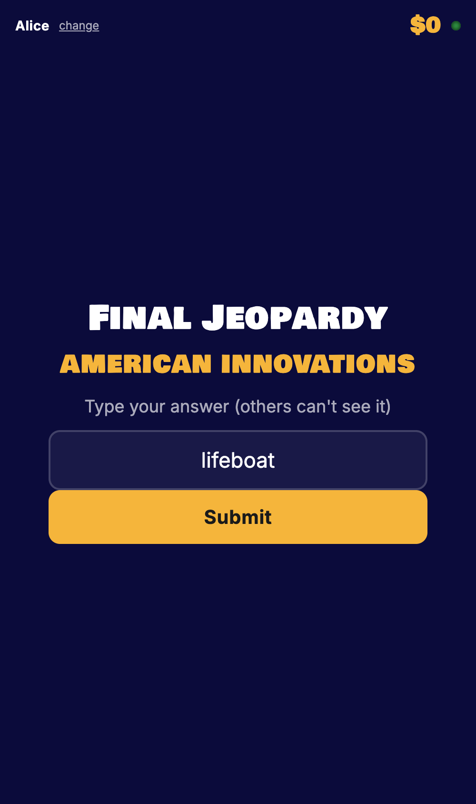
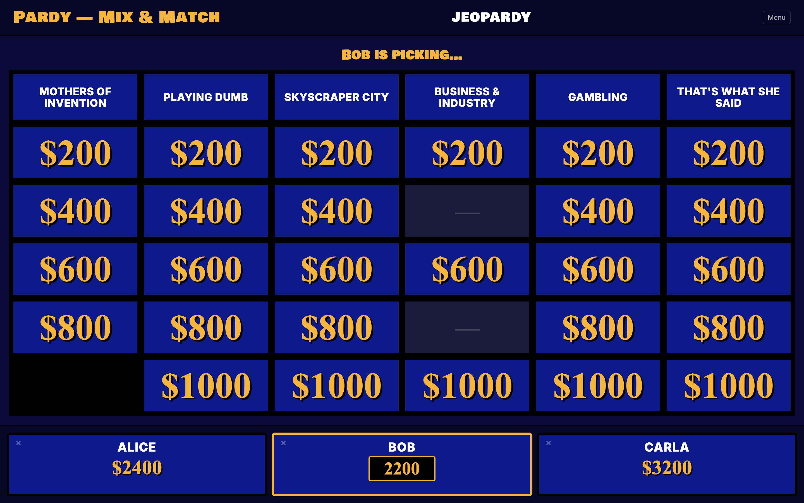

# Pardy

**Local Jeopardy! for parties — no host, no spoilers.**

Your laptop is the game board. Phones are buzzers. A speech-to-text model listens to the buzzed-in player's spoken answer and Claude judges whether it's correct, so **nobody at the party has to know the answers in advance**.


The whole stack runs on your machine. The only thing it phones home for is the LLM judge — and you can point that at OpenRouter (with web search via `:online`) instead of Anthropic if you'd rather.

> Built in a couple hours with Opus 4.7!

---

## What it looks like

### Lobby

Phones land on `/buzzer` after scanning the QR code, type a name, and they're in. The right rail picks a real-show **tier** — *Kids Week*, *Teen Tournament*, *Celebrity Jeopardy*, *College Championship*, *Tournament*, regular daily — or rolls a *Mix & Match* across all of them, or kicks off a **custom board** that an LLM tailors to your players.

| Host (laptop) | Phone (player) |
|:---:|:---:|
|  |  |

### Gameplay

Real clues from every season of *Jeopardy!*. Greyed `—` cells are clues that were skipped on the original air date — left in the board for visual completeness, unpickable.


When a clue is picked, Kokoro reads it aloud through your laptop speakers. Phones light up with a giant **BUZZ** button. First valid press wins the floor; that phone auto-records, faster-whisper transcribes, and Claude Haiku judges. Wrong answer → value penalty + buzz window reopens. Auto-advances when the judgement is read aloud — no "Continue" button.

| Reading the clue | Phone: BUZZ | Phone: answering |
|:---:|:---:|:---:|
|  |  |  |

### Custom board (Opus 4.7 + web search)

The killer mode. Each player records ~60 seconds on what they're good at. Opus 4.7 takes the transcripts, does live web research, and emits a tailored 6×5 + 6×5 + Final Jeopardy board with categories aimed at each player's strengths *and* weaknesses. Real research = real facts, not LLM hallucination — clues actually check out.

The build is **parallel**: a small planner call decides the 12 categories + Final, then 13 fan-out calls (one per category) each do their own web search and write 5 clues. Live progress streams to the host UI. Boards persist to disk under a "Saved Custom" tier so you can replay the same one next party.


The model runs through OpenRouter's `:online` (Exa-backed search) by default, or Anthropic's native `web_search_20260209` server tool if you have a direct API key.

### Final Jeopardy

Players sit next to each other and would hear each other speak, so Final answers are typed (not voice). Wagers are submitted privately on each phone first, then everyone gets the same prompt and types their best guess.



### Host controls

Click any score on the laptop scoreboard to edit it inline — useful when the LLM judge gets pedantic and you want to override without going through the modal flow. The host can also kick players from their cards, restart the game, reload the board, and pick exact episodes from a search panel covering all 8,660 episodes (1984–2025).



---

## Quick start

You'll need: **Node 22+**, **pnpm**, **[uv](https://docs.astral.sh/uv/)** for the Python voice services, and an **OpenRouter** or **Anthropic** API key.

```bash
git clone https://github.com/spagettnet/pardy.git && cd pardy

pnpm install               # Node deps
uv sync                    # Python deps for TTS/STT (Kokoro + faster-whisper)

cp .env.example .env       # then add OPENROUTER_API_KEY or ANTHROPIC_API_KEY
pnpm data:build            # ingest the J! Archive (one-time, ~1 min, ~3300 episodes)
pnpm cert                  # self-signed cert so phone mics get a permission prompt over LAN

pnpm party                 # boots TTS, STT, and the game server together
```

Open `https://localhost:3030/host` on the machine plugged into your TV. Players scan the QR. Click *Start Game* when ≥2 phones are in.

> First boot of the voice services downloads ~200MB of Kokoro + Whisper weights. Subsequent runs are instant.

---

## How it works

### Architecture

```
laptop  ──TTS──►  speakers (reads the clue)
phone   ──BUZZ──► laptop (state machine picks first valid press)
phone   ──MIC──►  STT ──text──► Claude judge ──► +/- score, riff
laptop  ◄──QR───  phones join https://<lan-ip>:3030/buzzer
```

- **State machine** (`src/state.ts`) — pure-ish reducer. All gameplay decisions live here: scoring, picker assignment, round transitions, daily-double wagers, Final Jeopardy. Server only feeds it events.
- **Server** (`src/server.ts`) — Node + websockets. Orchestrates TTS, STT, the judge, timers, and broadcasts public state to all clients. Never makes rulings on its own.
- **Judge** (`src/judge.ts`) — single tool-use call to Claude Haiku per answer. Returns `{correct, reason, riff}`. Lenient on STT noise.
- **Board builder** (`src/board_builder.ts`) — single big call to Claude Opus 4.7 with web search and a structured-output tool. Takes interview transcripts in, emits a complete `GameDef` out.
- **Voice services** (`tts_server.py`, `stt_server.py`) — Kokoro and faster-whisper exposed as tiny FastAPI servers on `:8000` / `:8001`. Vendored, no external dependency on another repo.
- **UIs** — vanilla HTML/CSS/JS, no build step.

### State diagram

```
LOBBY → PICKING → READING → OPEN → ANSWERING → JUDGING → RESOLVED → PICKING …
                                              ↘ wrong, others left → OPEN
                          ↘ DD_WAGER → DD_ANSWERING → JUDGING → RESOLVED
all clues taken (round 0) → ROUND_BREAK → PICKING (round 1)
all clues taken (round 1) → FINAL_WAGER → FINAL_READING → FINAL_ANSWERING
                          → JUDGING (per player) → FINAL_REVEAL → GAME_OVER

Custom board:  LOBBY → INTERVIEW (per-player) → BUILDING → LOBBY (with new def)
```

### Data

The clue dataset is [`jwolle1/jeopardy_clue_dataset`](https://github.com/jwolle1/jeopardy_clue_dataset) — ~538k clues across seasons 1–41 plus tournaments and celebrity specials. `pnpm data:build` parses, validates, tags by tier, and emits `data/episodes.json` + `data/categories.json` (both gitignored — rebuild on a fresh clone).

Result: ~3,300 fully-playable episodes broken down across regular, kids, teen, college, celebrity, and tournament tiers, plus a flat ~20k-category pool for the Mix & Match mode.

### Manual override

The LLM judge is good but not perfect. Whenever a ruling is fresh on screen, two buttons sit on the host UI: **Override → Correct** and **Override → Incorrect**. They cleanly reverse the score change and re-assign the picker. The override stays live even after auto-advance, so you can flip a bad call retroactively while the next clue is being picked.

---

## Configuration

Everything is environment variables. See `.env.example`.

| Var | Default | Purpose |
|---|---|---|
| `OPENROUTER_API_KEY` | — | Use OpenRouter (recommended for hobbyists). Web search via `:online`. |
| `ANTHROPIC_API_KEY` | — | Use Anthropic directly. Native `web_search_20260209` server tool. |
| `JUDGE_MODEL` | `claude-haiku-4-5-20251001` | Per-answer judge. Cheap, fast. |
| `BOARD_MODEL` | `claude-opus-4-7` | Custom-board agent. Big single call. |
| `PORT` | `3030` | Game server port. |
| `GAME_MODE` | `mix` | `mix`, `episode`, `tier`, or `sample`. |
| `GAME_AIR_DATE` | — | Exact episode air date for `episode` mode (e.g. `2003-01-23`). |
| `TTS_VOICE` | `af_heart` | Any Kokoro voice. |
| `STT_MODEL` | `small.en` | Any faster-whisper model. |

Without an LLM key, the judge falls back to a fuzzy string match. Workable for a single-player solo run, not great for a real game.

---

## File map

```
src/
  types.ts            shared types + websocket message shapes
  state.ts            pure state machine
  state.test.ts       unit tests
  games.ts            loaders: episode / mix-and-match / tier / sample
  judge.ts            Haiku judge + voice-pick matcher
  board_builder.ts    Opus 4.7 + web search + structured output
  llm.ts              Anthropic / OpenRouter routing
  voice.ts            HTTP wrappers around the local TTS/STT services
  server.ts           HTTP + websockets + effect runner
public/
  host.{html,css,js}    laptop game board
  buzzer.{html,css,js}  phone buzzer
tts_server.py         vendored Kokoro TTS (port 8000)
stt_server.py         vendored faster-whisper STT (port 8001)
scripts/
  start.sh            boots all three services together
  start-kokoro.sh     just TTS
  start-stt.sh        just STT
  gen-cert.sh         self-signed cert for HTTPS
  build_episodes.ts   J! Archive TSV → episodes.json
```

---

## Known limits

- No buzzer lockout penalty (TV rule: pressing during the read locks you out 0.25s). Current behavior is "first tap after TTS finishes wins."
- Audio/video-only clues from the dataset are filtered heuristically; a couple may sneak through with bland wording.
- Final Jeopardy expects all wagering players to record simultaneously. Phones in the same room *may* hear each other — keep some distance.
- The TTS audio store is in-memory and capped at 64 entries. Long parties churn; bump the limit in `server.ts` if you notice it.

---

## License

MIT — see [LICENSE](LICENSE). Have fun.
