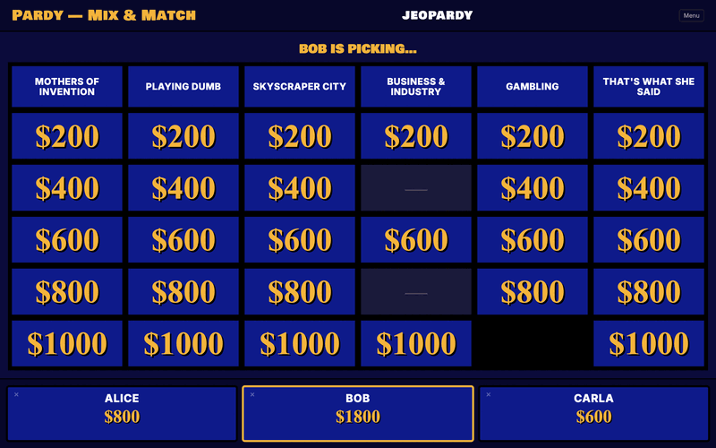
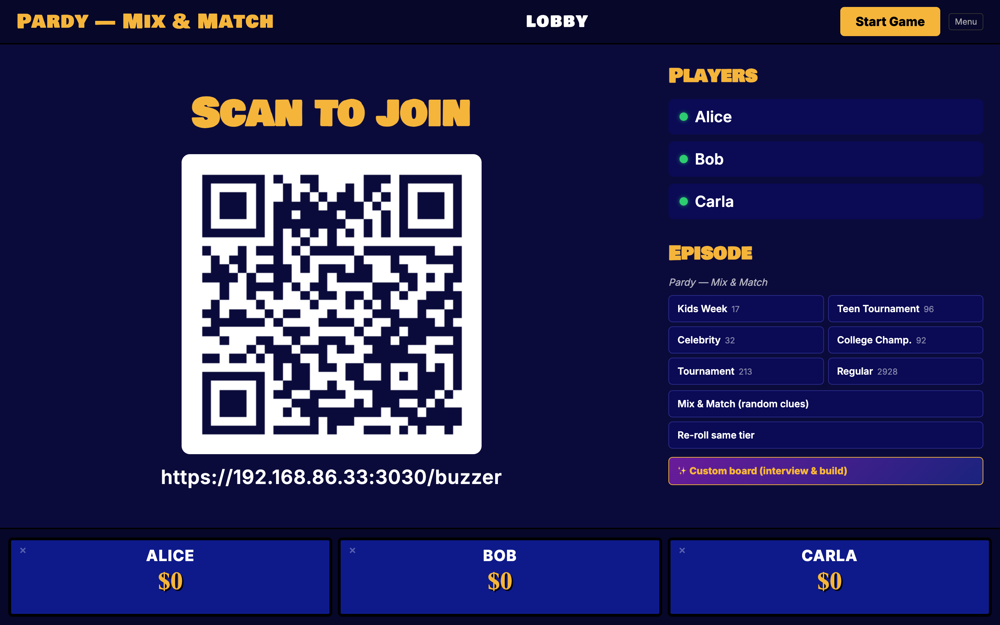
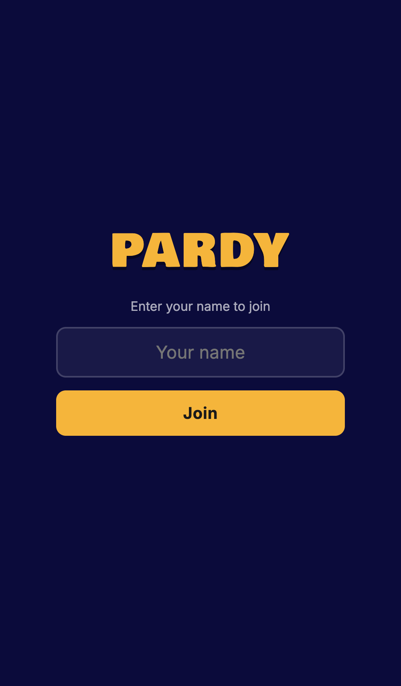
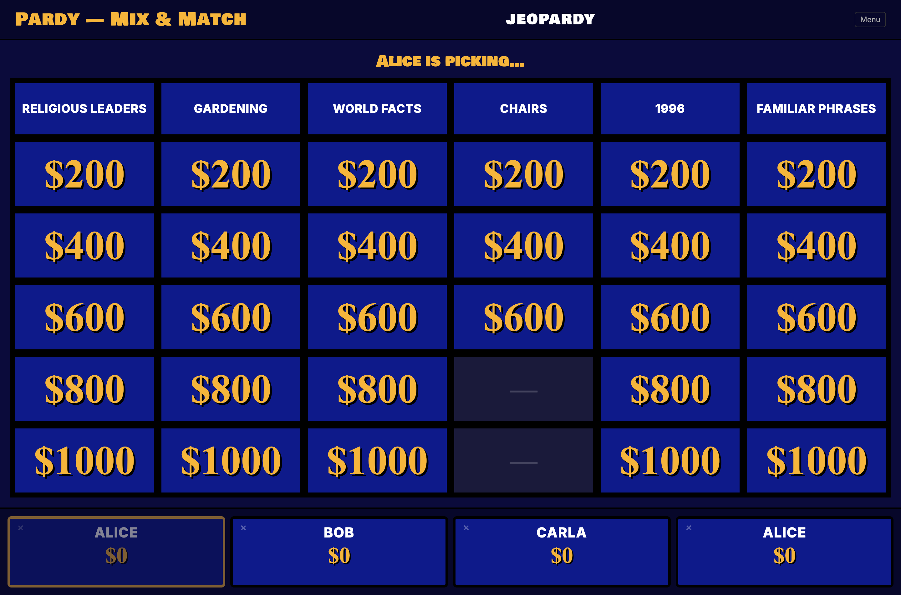
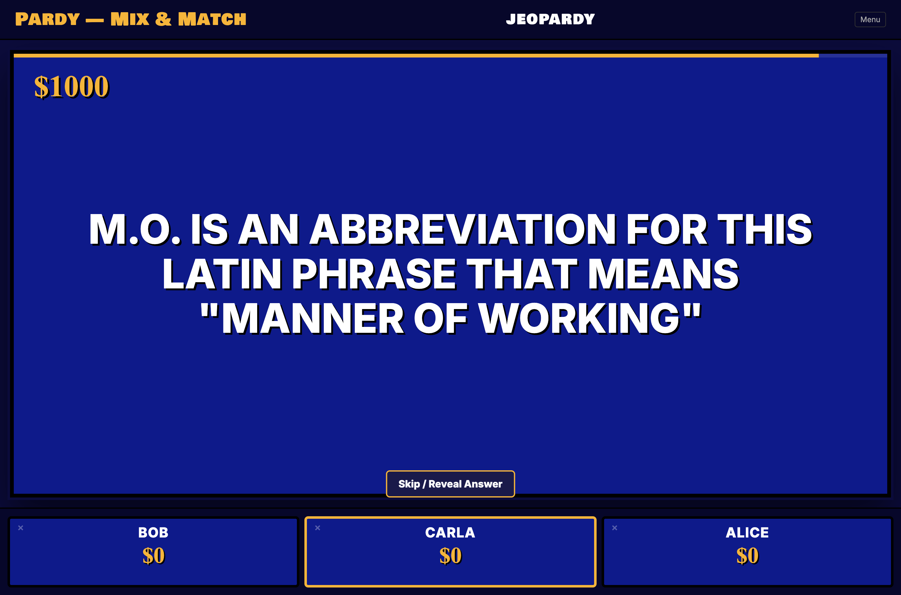
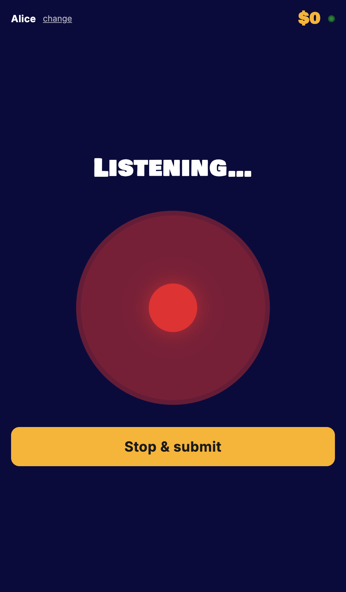
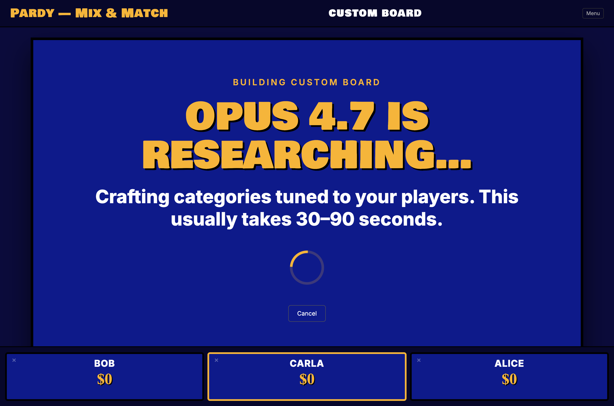

# Pardy — local Jeopardy for parties

Your laptop is the host & game board. Phones are buzzers (joined by QR code).
A speech-to-text model listens to the buzzed-in player's spoken answer and a
small Anthropic model judges whether it's correct, so **nobody at the party has
to know the answers in advance**.



```
laptop  ──TTS──►  speakers (reads the clue)
phone   ──BUZZ──► laptop (state machine picks first valid press)
phone   ──MIC──►  STT ──text──► Haiku judge ──► +/- score, riff
laptop  ◄──QR───  phones join http://<lan-ip>:3030/buzzer
```

All voice services run locally — no cloud-side STT/TTS. The repo is
self-contained: vendored Python TTS (Kokoro ONNX) and STT (faster-whisper)
boot alongside the Node game server.

## What it looks like

### Lobby

The host display shows a QR code; phones land on `/buzzer` and join with a name. An "Episode" panel lets you pick a real-show tier (Kids Week / Teen / Celeb / Tournament / Regular), shuffle clues across all tiers (Mix & Match), or fire up the **custom-board** flow.

| Host (laptop) | Phone (player) |
|:---:|:---:|
|  |  |

### Gameplay

Real Jeopardy! board, real clues from the J! Archive. Greyed `—` cells are clues that were skipped on the original air date.



When a clue is picked, TTS reads it aloud. Phones get a giant BUZZ button. The first valid press wins the floor; that phone auto-records, faster-whisper transcribes, and Haiku judges. Wrong answers get a value penalty and the buzz window reopens to the rest. Auto-advances when the judgement is read aloud.

| Reading the clue | Phone: BUZZ | Phone: answering |
|:---:|:---:|:---:|
|  |  |  |

### Custom board (Opus 4.7 + web search)

Each player records ~60s on what they're good at. Opus 4.7 takes the transcripts, does live web search via OpenRouter's `:online` (or Anthropic's `web_search_20260209` if you have a direct key), and emits a tailored 6×5 + 6×5 + Final board with categories aimed at each player's strengths and weaknesses.



## Stack

- Node 22+ (TypeScript via `tsx`)
- `ws` for websockets (host + phones)
- `@anthropic-ai/sdk` (works against direct Anthropic or OpenRouter)
- Vendored Kokoro TTS server (`tts_server.py`, `:8000`)
- Vendored faster-whisper STT server (`stt_server.py`, `:8001`)
- Python deps managed by [uv](https://docs.astral.sh/uv/) via `pyproject.toml`
- Vanilla HTML/CSS/JS for both UIs (no build step)

## One-time setup

```bash
# Node deps
pnpm install

# Python deps for TTS/STT (handled lazily by `pnpm party`, but you can prime it)
uv sync

cp .env.example .env
# add OPENROUTER_API_KEY (recommended) or ANTHROPIC_API_KEY for the judge
# without either, judge falls back to dumb string match

# Pull and process the J! Archive dataset (~530k clues -> ~1000 complete episodes + tournaments)
pnpm data:build

# Generate a self-signed cert so phone mics can prompt for permission over LAN
pnpm cert
```

Requires `uv` for the Python services: `brew install uv` (or `curl -LsSf https://astral.sh/uv/install.sh | sh`).

## Running a party

```bash
pnpm party
```

That single command boots TTS, STT, and the game server, waits for the voice
services' `/health` endpoints, and tails them all under `logs/`. Ctrl-C kills
all three.

If you'd rather run them separately:

```bash
# terminal 1
pnpm tts:start
# terminal 2
pnpm stt:start
# terminal 3
pnpm dev
```

Then:

1. On the laptop: open `http://localhost:3030/host`. Plug into the TV / external display.
2. Each guest scans the QR code on the host screen, lands on `/buzzer`, types a name, joins.
3. When ≥2 players are joined, the host clicks **Start Game**.
4. Pick a clue from the board (host clicks the cell — the picker can also indicate a choice verbally and the host taps it).
5. TTS reads the clue. Phones buzz on tap. First valid press wins.
6. Buzzed phone auto-starts mic, player speaks, Haiku judges, score updates.
7. Wrong → others get to buzz in (with a value penalty). Empty board → Double Jeopardy → Final.

### Modes

```bash
GAME_MODE=mix        pnpm dev   # 6 random round-1 cats + 6 random round-2 cats + random Final (default)
GAME_MODE=episode    pnpm dev   # full real airing-day episode, picked at random
GAME_MODE=episode GAME_AIR_DATE=2003-01-23 pnpm dev   # exact episode
GAME_MODE=sample     pnpm dev   # tiny hand-curated sample (no data build needed)
```

## Manual override (the trust-but-verify lever)

The judge is good but not perfect. The host UI shows the most recent ruling
with two buttons:

- `Override → Correct`
- `Override → Incorrect`

Either button reverses the score change cleanly and re-assigns the picker
where appropriate. Use it whenever STT mishears or the LLM is being a pedant.

## How the state machine works

`src/state.ts` is a pure-ish reducer. All gameplay decisions live there:

```
LOBBY → PICKING → READING → OPEN → ANSWERING → JUDGING → RESOLVED → PICKING …
                                              ↘  (wrong, others left) → OPEN
                          ↘ DD_WAGER → DD_ANSWERING → JUDGING → RESOLVED
              … all clues taken in round 0 → ROUND_BREAK → PICKING (round 1)
              … all clues taken in round 1 → FINAL_WAGER → FINAL_READING
                                            → FINAL_ANSWERING → JUDGING* → FINAL_REVEAL → GAME_OVER
```

The server orchestrates side effects (TTS, STT, judging, timers) but never
makes gameplay rulings on its own — it only feeds events back into the
machine. That keeps the rules deterministic and testable.

## File map

```
src/
  types.ts        shared types + websocket message shapes
  state.ts        pure state machine (events, effects, applies)
  games.ts        loaders: random episode / mix-and-match / sample
  judge.ts        Anthropic Haiku call with a single 'judgement' tool
  voice.ts        thin wrappers around voice_xw TTS/STT servers
  server.ts       http + ws + effect runner
public/
  host.html/.css/.js   laptop game board
  buzzer.html/.css/.js phone buzzer
data/
  raw/            (gitignored) source TSV
  episodes.json   (gitignored) built episodes
  categories.json (gitignored) flat category pool for mix-and-match
  sample-game.json hand-curated fallback (1 round + Final)
scripts/
  build_episodes.ts   TSV → episodes.json + categories.json
```

## Data source

The clue dataset is [`jwolle1/jeopardy_clue_dataset`](https://github.com/jwolle1/jeopardy_clue_dataset) — ~538k
clues across seasons 1-41 of the TV show. We translate its column names
("answer" → our `prompt`, "question" → our `answer`) to match the natural
direction (you read the prompt; the player gives the answer).

Episodes with incomplete boards (skipped clues, weird formats, or audio/visual-
only clues) are dropped during the build, leaving ~1000 fully-playable
episodes plus 6,438 categories per round for mix-and-match.

## Known limits / possible improvements

- No buzzer lockout penalty (TV rule: pressing during the clue read locks you
  out for 0.25s). The current rule is "first tap after TTS finishes wins".
  Easy to add.
- Audio-only / video-only clues from the dataset are filtered out, but a few
  may sneak through if their wording isn't suspicious.
- Final Jeopardy currently asks all wagering players to record simultaneously
  — works fine across separate phones, but be mindful that nearby phones may
  hear each other.
- TTS cache is in-memory; long parties might churn. Bump the eviction limit
  in `server.ts` if needed.
